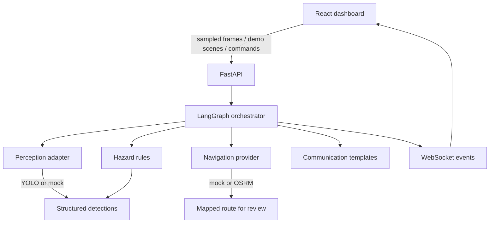

# VisionMate

**See the surroundings. Understand the situation. Navigate with awareness.**

VisionMate is an experimental, hackathon-ready prototype for **WCC Launchpad 30 (Agentic AI track)**. It helps a user understand a camera view, apply conservative hazard heuristics, and let an explicit agent orchestrator decide whether to request another observation, check a mapped route, or speak a cautious alert.

This is **not** a certified mobility aid. Do not use it for unsupervised real-world navigation.

## Problem

Map apps give turn-by-turn directions but do not understand a parked motorcycle on a footpath, a pedestrian crossing the view, or a blurry frame. VisionMate combines local visual perception with tool-using orchestration so those situations can be handled differently — and uncertainty is spoken out loud.

## Key features

- Sampled camera frames or labeled demo scenes
- YOLO object detection when the model loads; mock/demo fallback otherwise
- IOU tracking for object persistence
- Deterministic hazard assessment (no fake distances)
- LangGraph orchestrator: perception → hazard → optional route tool → communication → monitor
- Mock routing (optional OSRM)
- WebSocket activity stream and browser speech
- Independent GPS turn prompts and a priority-aware, deduplicated voice queue
- Accessible dark UI with large controls

## Architecture



## Tech stack

| Layer | Stack |
| --- | --- |
| Frontend | React, Vite, TypeScript, Tailwind, Leaflet, Web Speech |
| Backend | FastAPI, Pydantic, Ultralytics YOLO, OpenCV, LangGraph, HTTPX |
| Map / routing | OpenStreetMap tiles, mock router or OSRM |

## Repository structure

```
visionmate/
├── frontend/     React application
├── backend/      FastAPI application
├── docs/         Architecture, API, demo script
└── README.md
```

## Installation

Requires **Python 3.11+** and **Node.js 18+**.

### Backend

```powershell
cd backend
python -m venv .venv
.\.venv\Scripts\Activate.ps1
pip install -r requirements.txt
copy .env.example .env
uvicorn app.main:app --reload --host 127.0.0.1 --port 8000
```

API docs: [http://127.0.0.1:8000/docs](http://127.0.0.1:8000/docs)

### Frontend

```powershell
cd frontend
npm install
npm run dev
```

Open [http://localhost:5173](http://localhost:5173). Vite proxies `/api` and `/ws` to the backend.

## Environment variables

See `backend/.env.example`.

| Variable | Meaning |
| --- | --- |
| `VISIONMATE_PERCEPTION_MODE` | `auto`, `yolo`, or `mock` |
| `VISIONMATE_YOLO_MODEL` | Ultralytics model name, default `yolo11s.pt`; falls back to `yolov8n.pt` if unavailable |
| `VISIONMATE_INFERENCE_MAX_SIDE` | Maximum inference image side, default `960` |
| `VISIONMATE_YOLO_CONFIDENCE` | Detection threshold, default `0.2`; lower values may add false positives |
| `VISIONMATE_YOLO_MAX_DETECTIONS` | Maximum objects returned per frame, default `100` |
| `VISIONMATE_ROUTING_PROVIDER` | `mock` or `osrm` |
| `VISIONMATE_OSRM_BASE_URL` | OSRM endpoint |
| `VISIONMATE_CORS_ORIGINS` | Allowed frontend origins |
| `VISIONMATE_TURN_THRESHOLDS_M` | Mapped turn prompt distances in meters, default `500,200,100,30` |

No paid LLM key is required.

## Model download

On first run, Ultralytics downloads `yolo11s.pt`. If that model cannot load, the backend tries `yolov8n.pt` before falling back to mock perception. Larger models and 960-pixel inference can take longer, especially on CPU.

The default is tuned to retain more small or lower-confidence detections than the earlier nano / 640-pixel setup. Lower confidence thresholds can also add false positives. Model accuracy varies with camera quality, lighting, viewpoint, and object type; validate on representative recorded scenes before relying on the output. The pretrained model does not recognize every mobility hazard, and VisionMate remains an experimental prototype.

Stairs, curbs, potholes, and sidewalk accessibility are **not** in the pretrained COCO classes and are documented as future work.

## Routing

Default **mock** routing returns clearly labeled simulated geometry. Set `VISIONMATE_ROUTING_PROVIDER=osrm` to query a public or self-hosted OSRM instance. Timeouts and errors are returned as failures; no alternate route is invented.

## Demo mode (recommended for judging)

1. Start backend and frontend.
2. Open the app → **Get Started**.
3. Click **Start assistance**.
4. Use **Hackathon demonstration**:
   - Load clear scene — no route tool
   - Load blocked scene — motorcycle persists, route tool runs, cautious speech
   - Simulate obstacle removal — hazard clears, reassessment
   - Simulate route API failure — error, no fabricated geometry
5. Watch **Agentic AI Activity** for tool reasons and results.

All simulated detections and mock routes are labeled in the UI.

## Real camera mode

1. Settings: turn **Demo mode** off (or start a session with demo_mode false).
2. Allow camera permission.
3. **Start camera**. Frames are resized and sent at a low rate. Raw video is not stored by default.
4. If YOLO is unavailable, detections will be empty (mock). Use demo scenes for a reliable agent demo.

Do not test unsupervised outdoors. Use a recorded or controlled scene.

## Navigation voice prompts

On the Navigation screen, choose **Turn on location** to grant browser location access. VisionMate uses accurate GPS fixes and mapped maneuver points to announce route distances. On a simulated route, the developer demo buttons send labeled simulated GPS fixes. Location prompts describe mapped directions only; they do not assess whether a crossing or path is safe.

## Testing

```powershell
cd backend
.\.venv\Scripts\Activate.ps1
pytest
```

Tests use mock perception and mock routing. No camera, GPU, or OSRM is required.

## Known limitations

- Monocular boxes are **not** distances.
- The system never claims a route is safe or tells the user to cross a road.
- Optional scene descriptions do not call a cloud VLM in this MVP.
- In-memory sessions only; not multi-instance production storage.
- Browser speech recognition support varies.

## Safety disclaimer

VisionMate is a research/hackathon prototype. When uncertain it says: *I cannot clearly assess the path ahead. Please pause and check your surroundings.*

## Future roadmap

- Specialized curb/stair models
- On-device depth or stereo
- Persistent session store and auth
- Optional constrained VLM descriptions
- Offline OSM / OSRM packaging

## License

Prototype code for the WCC Launchpad 30 hackathon.
